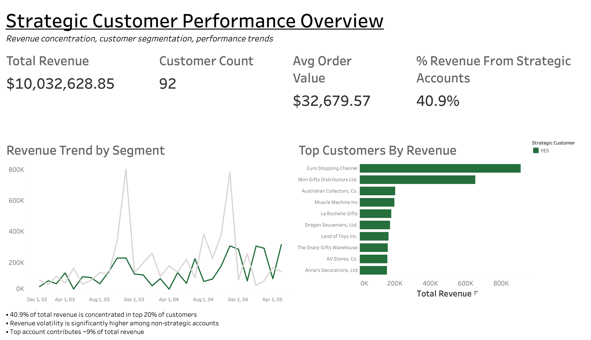

# Strategic Customer KPI Dashboard
End-to-end analytics project analyzing strategic customer KPIs, risks, and performance trends.

## Dashboard Preview

## Interactive Dashboard

View the live dashboard here:
[Strategic Customer Performance Dashboard](https://public.tableau.com/app/profile/jacob.leischner/viz/StrategicCustomerKPIDashboard/Dashboard2?publish=yes)

Overview:
This project simulates a program operations analyst supporting a portfolio of strategic customers. The goal is to monitor performance, identify risk signals, and provide actionable insights to leadership.

Business Questions:
  Which customers are most at risk of escalation?
  What KPIs best indicate declining performance?
  Are high-revenue customers receiving adequate operational support?
  Where should leadership intervene this quarter?

Data:
The dataset represents a fictional portfolio of strategic customers and includes:
  Revenue and contract value
  SLA compliance and delivery performance
  Support tickets and escalations
  Customer satisfaction indicators

Tools Used
  Excel (data cleaning & KPI creation)
  Tableau (dashboard and visualization)
  GitHub (project documentation)

## Key Insights

### 1. Revenue Concentration Risk
Approximately 40.9% of total revenue is generated by the top 20% of customers, indicating meaningful revenue concentration.

### 2. Strategic vs. Non-Strategic Revenue Behavior
Revenue trends show that strategic accounts provide consistent baseline revenue, while non-strategic accounts exhibit greater volatility over time.

### 3. Customer Performance Distribution
Top-performing accounts significantly outperform the median customer in both revenue and order frequency, reinforcing the value of segmentation.

### 4. Deal Size & Purchasing Patterns
Strategic customers demonstrate higher average deal sizes and more consistent purchasing behavior.

## Recommendations

### 1. Formalize Strategic Account Management
Given that a meaningful share of total revenue is concentrated within the top 20% of customers, implement a structured account management process for strategic accounts to protect core revenue.

**Recommended actions:**
- Establish monthly performance reviews for strategic accounts
- Assign clear account ownership and renewal/retention planning
- Monitor early-warning signals (declining order frequency, shrinking average deal size)

---

### 2. Reduce Revenue Concentration Risk
While strategic accounts provide stability, heavy dependence on a small segment increases exposure to churn and demand shocks. Build a stronger mid-tier to diversify revenue over time.

**Recommended actions:**
- Identify high-growth mid-tier customers (“emerging strategic”) using revenue trajectory
- Launch targeted cross-sell / upsell initiatives by product line
- Track movement of customers between tiers quarter-over-quarter

---

### 3. Segment Service Levels by Customer Tier
Strategic customers show larger deal sizes and more consistent purchasing behavior. Align service delivery and engagement strategy to customer value.

**Recommended actions:**
- Implement tiered support (premium service for strategic accounts)
- Tailor outreach cadence and escalation paths by tier
- Customize product-line offers based on historical purchasing patterns

---

### 4. Institutionalize Executive KPI Monitoring
Make segmentation and concentration visible through a small set of recurring metrics.

**Track monthly:**
- % Revenue from Strategic Customers
- Revenue growth by segment (Strategic vs Non-Strategic)
- Order frequency by segment
- Average deal size by segment
- Order status mix (to monitor operational he
::contentReference[oaicite:0]{index=0}

The organization benefits from strong high-value accounts, but long-term resilience will depend on balancing revenue concentration with scalable mid-tier customer growth.
